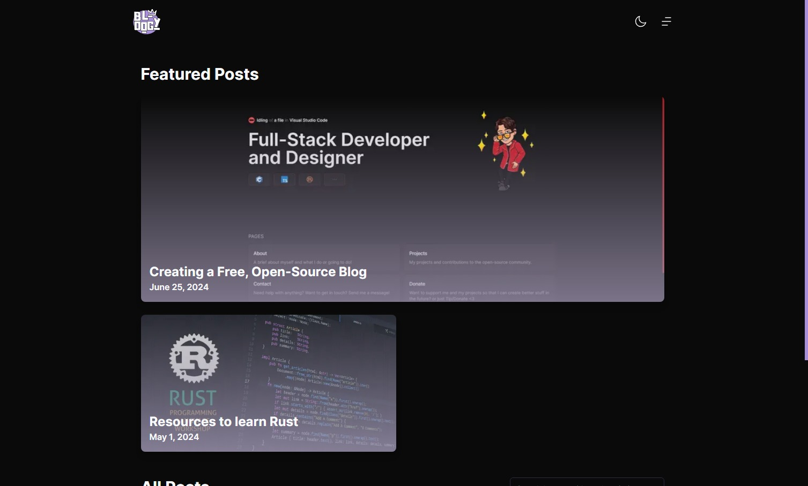
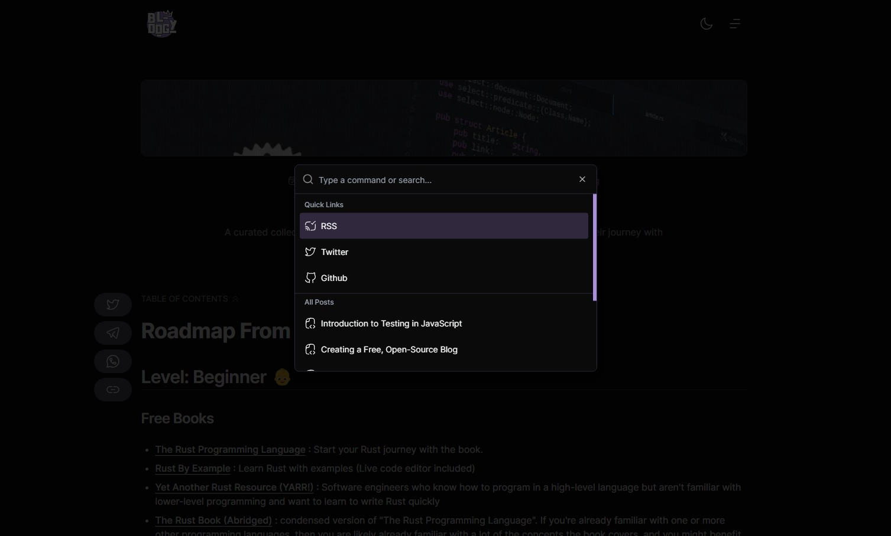
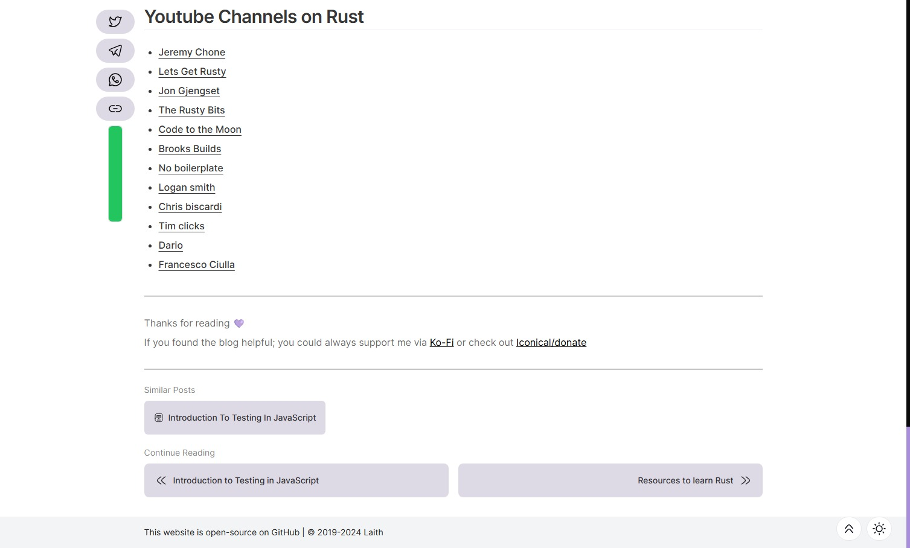
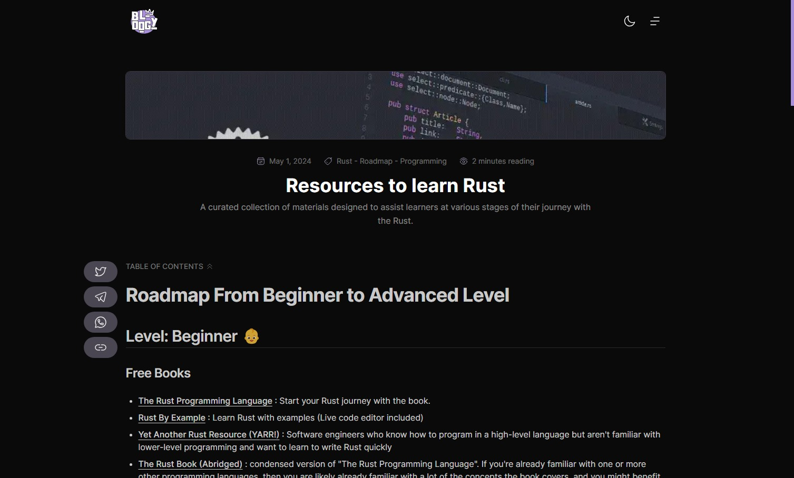
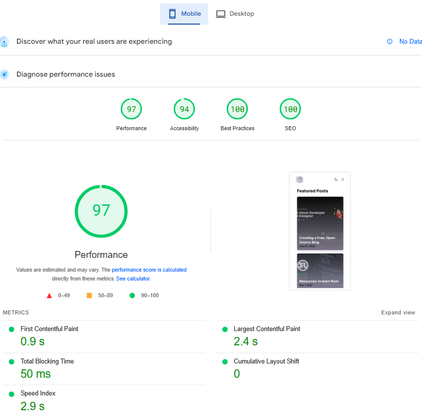
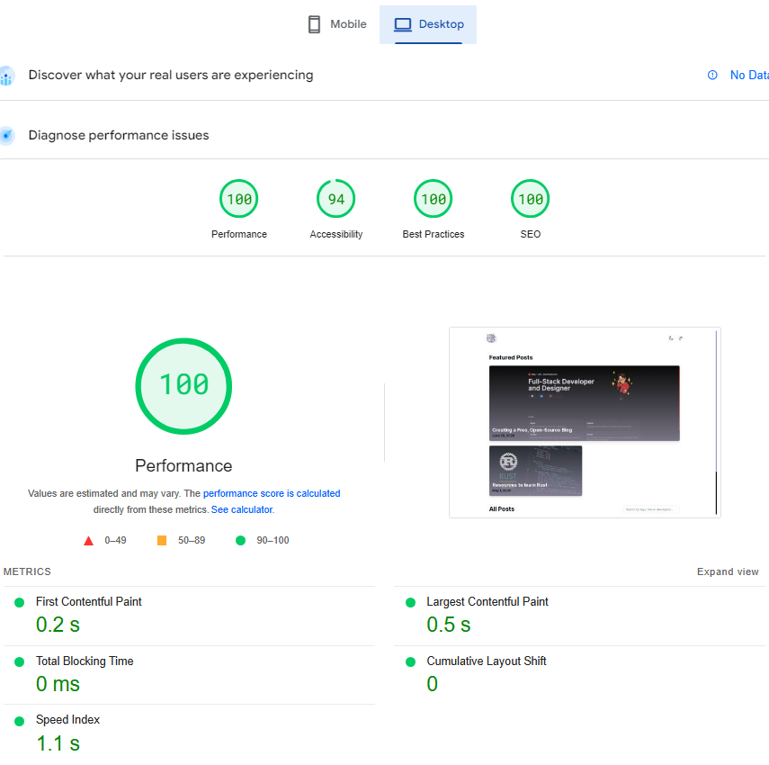

<h2 align="center">
Bloggy - Your personal blog
<div align="center" style="padding-top: 10px;">
  <a href="https://app.codacy.com/gh/Sleepyico/bloggy/dashboard?utm_source=gh&utm_medium=referral&utm_content=&utm_campaign=Badge_grade"></a>
  
  
  
  
 
</div>
</h2>
<p align="center">
<a href="https://vercel.com/new/clone?repository-url=https://github.com/sleepyico/bloggy/tree/master&project-name=bloggy&repo-name=bloggy" rel="nofollow"></a>
<a href="https://app.netlify.com/start/deploy?repository=https://github.com/sleepyico/bloggy" rel="nofollow"></a>
</p>

## 👋 Introduction

Here I will share the problems and solutions encountered by various technology stacks, let you know the latest technology stack and how to apply it in actual development, and I hope my development experience will inspire you.

If you want to build a similar site, you can [Fork](https://github.com/sleepyico/bloggy/fork) this repository directly, or deploy it with one click through [Vercel](https://vercel.com/new/clone?repository-url=https://github.com/sleepyico/bloggy/tree/master&project-name=bloggy&repo-name=bloggy) .

> [!NOTE]
> For now, this blog is still in development, so some of the content might be missing or outdated. I hope I'll be able to update or fix it as soon as possible if there are any issues or updates. Thank you for your patience and understanding.

## ✨ Features

- 💀 **Iconical** - Based on my portfolio, providing powerful document generation and blogging capabilities
- ✍️ **Markdown** - Easy to write, Markdown using MDX
- 🎨 **Beautiful** - neat, beautiful, reading experience first
- 🖥️ **PWA** - Supports PWA, installable, and available offline
- 💯 **SEO** - Search engine optimization, easy to be included
- 🔎 **Full text search** - Support searching by the Title, description, and tags.
- 🚀 **Continuous Integration** - Support CI/CD, automatically deploy updated content
- 🏞️ **Homepage view** - Displays the latest featured blog posts, and all posts below in a grid view without repeating the featured posts unless they are older than the current featured posts.
- 🗃️ **Blog** - An amazing experience for reading blog posts with a minimal design and a clean interface.
- 📄 **Post** - With the minimal design, supporting it a reading indicator and share buttons for each post to make it easier to share and promote.
- 🌈 **Navigation** - Smooth navigation, easy to find and use. 
- 🌙 **Dark mode** - Supports dark mode, and the color scheme is customizable.
- 📱 **Responsive** - Supports mobile devices with a responsive and clean design and layout.

## 🔧 Tech Stack

- Next.js
- TailwindCSS
- Framer motion
- TypeScript
- React
- MDX
- ...etc

## 📥 Run

```bash
git clone https://github.com/sleepyico/bloggy.git
cd bloggy
bun install
bun start
```

Development

```bash
bun dev
```
Construct

```bash
bun build
```

## 📄 Posts 

Add your files posts in the `src/content` folder, and name them with the following format: `post.mdx.example`

```mdx
---
title: # title
description: # description
banner: # /posts/yourimage.png in public  folder
tags:
  - # tag 1 
  - # tag 2
  - # tag 3
related:
  - # related post slug aka (file name)
date: # date (year-month-day hour:minute:second)
published: # boolean (optional)
featured: # boolean (optional)
indicatorsHidden: # boolean (optional)
special: # boolean (optional)(has no use for now)
color: # color (optional)(changes the color for SEO and etc...)
---

# your post content here
```

## 📷 Screenshots

<div align="center" width="100%">
  
  
  
  
  
  
</div>

## 🧑‍💻 Author

- [Laith](https://github.com/sleepyico)

## ☕ Contribution

I have started this project to gain experience in building actually useful things for the community, so I'm always looking for ways to improve it. With your help, I can make this project better and more useful for everyone and I am open to see your solutions or changes to my project that you think it could have been better. 

Thank you for your support! If you like this project, please consider contributing to it by:

- 🌟 Starring this project
- 🐞 Creating issues and pull requests
- 💬 Commenting on issues and pull requests
- 🗣️ Sharing your thoughts on discussions
- 💡 Suggesting new features
- 📝 Writing documentation
- 🔧 Refactor what you think could have been approached better

## 💸 Sponsor or Support me

If you want to support this project, you can sponsor me on:
- Membership on [Ko-Fi](https://ko-fi.com/iconical)
- Sponsor me on [Github](https://github.com/sponsors/sleepyico) 
- Follow me on [Twitter](https://twitter.com/sleepyiconical)
- Tip to what your heart desires on [Iconical/donate](https://iconical.dev/donate)

## 📝 License

This project is licensed under the [APACHE 2.0](./LICENSE) License.